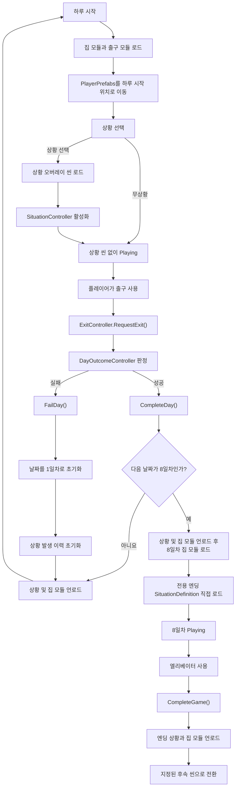
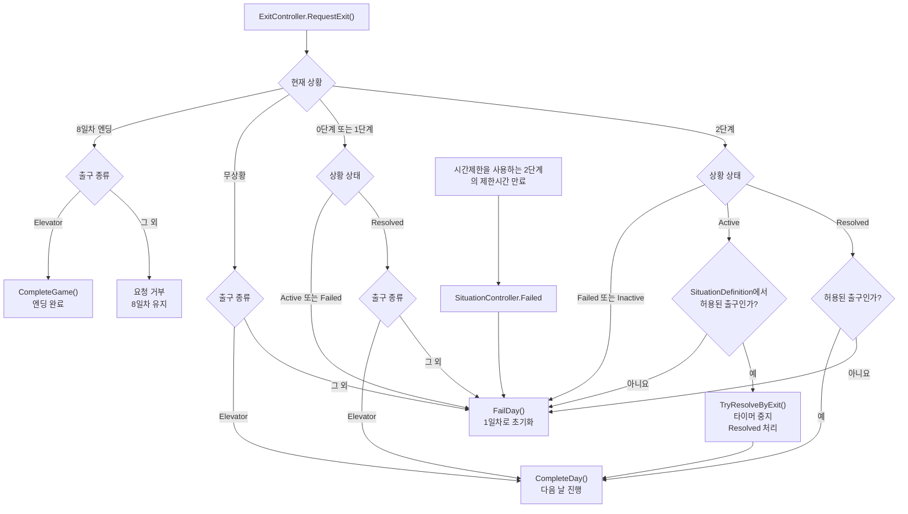

# 7 Days Unchecked 게임 루프 개발 계획

## 1. 목표

1일차부터 7일차까지 매일 집 모듈과 출구 모듈을 비동기로 구성하고, 무상황 또는 상황 하나를 진행한다. 7일차를 성공적으로 마치면 8일차 전용 엔딩 상황을 반드시 로드하며, 엔딩 상황에서 엘리베이터를 통해 나간 뒤 한 사이클을 클리어한다.

상황이 선택되면 트리거, 오브젝트, 파티클, 오디오와 판정 로직만 포함한 상황 오버레이 씬을 Additive 방식으로 추가 로드한다. 상황 해결만으로 하루가 끝나지는 않으며, 플레이어가 상황 규칙에 맞는 출구를 사용해야 다음 날로 진행한다.

```text
하루 시작
→ 기본 집 모듈 및 임시 ExitScene 비동기 로드
→ PlayerPrefabs를 하루 시작 위치로 이동
→ 무상황 또는 상황 하나 선택
→ 선택된 경우 상황 오버레이 씬 로드 및 활성화
→ 플레이어 탐색 및 상황 해결
→ 출구 사용
→ DayOutcomeController가 상황 상태와 출구 종류 판정
→ 성공 시 다음 날 / 실패 시 1일차
→ 7일차 성공 후 8일차 집 모듈과 전용 엔딩 상황 로드
→ 엔딩 상황에서 엘리베이터 사용 시 클리어
→ 엔딩 정리 후 지정된 후속 씬으로 전환
```

## 2. 핵심 규칙

### 날짜와 사이클

- 1일차부터 7일차까지를 한 사이클로 취급한다.
- 다음 날로 진행할 때 현재 사이클의 상황 발생 이력을 유지한다.
- 실패하면 1일차로 돌아가며 상황 발생 이력을 전부 초기화한다.
- 7일차 성공 후 8일차에 도달하는 것만으로는 게임을 클리어하지 않는다.
- 8일차 집 모듈과 전용 엔딩 상황이 정상적으로 로드된 뒤 `Playing` 상태에 진입한다.
- 엔딩 상황에서 엘리베이터를 사용하면 게임을 클리어하고 지정된 후속 씬으로 전환한다.

### 8일차 엔딩 상황

- 엔딩은 일반 상황 후보가 아니며 `SituationSelector.Candidates`에 등록하지 않는다.
- `DaySceneCoordinator`가 Inspector로 별도 연결된 엔딩 `SituationDefinition`을 8일차에 직접 로드한다.
- 8일차에는 무상황 확률과 일반 상황 가중치 선택을 적용하지 않는다.
- 엔딩 상황은 사이클 내 상황 발생 이력에 등록하지 않는다.
- 엔딩 씬도 기존 `SituationSceneLoader` 계약을 따르므로 씬 루트의 `SituationSceneRoot` 하나와 해당 루트 또는 자식의 구체적인 `SituationController`가 필요하다.
- 엔딩 상황은 별도의 해결 상태를 요구하지 않으며, 엔딩 정의와 컨트롤러가 정상 로드된 상태에서 엘리베이터 출구 요청을 받으면 완료된다.
- 엔딩 중 다른 출구 요청은 실패로 처리해 1일차로 초기화하지 않고 거부한다.
- 엔딩 완료 후 이동할 후속 씬은 아직 확정하지 않으며, 설정된 씬 이름을 통해 교체할 수 있도록 유지한다.

### 상황 선택

- 하루에는 무상황이거나 정확히 하나의 상황만 존재한다.
- 같은 사이클에서 정상적으로 로드되어 제시된 0·1·2단계 상황은 다시 선택하지 않는다.
- 상황 ID는 상황 씬 로드와 초기화가 성공한 뒤 발생 이력에 등록한다.
- 무상황은 `SituationDefinition` 없이 `null`로 표현한다.
- 무상황은 발생 이력에 기록하지 않으며 한 사이클에서 반복될 수 있다.
- 현재 날짜에 등장 가능한 미발생 상황이 없으면 무상황으로 진행한다.

### 단계별 제한시간과 출구

| 진행 상태 | 제한시간 | 성공 가능한 출구 |
| --- | --- | --- |
| 무상황 | 없음 | 엘리베이터 |
| 0단계 | 없음 | 상황 해결 후 엘리베이터 |
| 1단계 | 없음 | 상황 해결 후 엘리베이터 |
| 2단계·시간제한 사용 | SO에 설정된 양수 제한시간 | 제한시간 내 해당 상황에 설정된 탈출구 도달 |
| 2단계·시간제한 미사용 | 없음 | 해당 상황에 설정된 탈출구 도달 |

- 2단계에서는 엘리베이터를 허용하지 않는다.
- 2단계의 제한시간 사용 여부는 `SituationDefinition.Uses Time Limit` 플래그로 결정한다.
- `Uses Time Limit`가 꺼진 2단계 상황은 제한시간 만료 실패와 시간 압박 연출을 사용하지 않는다.
- 0·1단계 상황은 미해결 상태에서 출구를 사용하면 실패한다.
- 2단계 상황은 `Active` 상태에서 허용된 출구에 도달하면 그 출구 요청으로 상황을 해결한다.
- `ResolveSituation()`은 출구 사용이 가능한 상태로 만드는 처리이며 날짜를 직접 변경하지 않는다.
- 시간제한을 사용하는 2단계의 출구 해결은 내부적으로 `ResolveSituation()`을 거쳐 타이머를 중지한 뒤 날짜를 변경한다.
- 최종 날짜 변경은 `DayOutcomeController`만 `CompleteDay()` 또는 `FailDay()`를 호출해 수행한다.

## 3. 씬 구성

### Core 씬: `LoopBase`

Core 씬의 경로는 `Assets/01_Scenes/Situation/LoopBase.unity`다. 날짜가 바뀌어도 유지되는 전역 오브젝트만 가진다.

- XR Player와 Main Camera
- 전역 조명, UI, EventSystem 등 공통 요소
- `DayFlowController`
- `DaySceneCoordinator`
- `DayOutcomeController`
- `HomeModuleLoader`
- `SituationSelector`
- `SituationSceneLoader`
- `Level2TimePressureEffect`
- `RadioController`
- `DoorRegistry`

인스펙터 설정:

- `DayFlowController.Start Automatically`를 활성화한다.
- `DaySceneCoordinator`에 위 컨트롤러, 로더, 정의 에셋 참조를 연결한다.
- `DaySceneCoordinator.Player Root`에 Core 씬의 `PlayerPrefabs`를 연결한다.
- `DaySceneCoordinator.Day Start Spawn Point`에 매일 돌아갈 시작 위치를 연결한다.
- `DaySceneCoordinator.Screen Fader`에 `PlayerPrefabs` 자식 `XRFadeCanvas`의 `ScreenFader`를 연결한다.
- `DaySceneCoordinator.Radio Controller`에 하루 시작 방송을 담당할 `RadioController`를 연결한다.
- `DayOutcomeController`에 `DayFlowController`와 `SituationSceneLoader`를 연결한다.
- `GameFlow` 오브젝트에 `Level2TimePressureEffect`를 추가하고 같은 오브젝트의 `DayFlowController`와 `SituationSceneLoader`를 연결한다.
- `Level2TimePressureEffect.Cough Audio Source`에는 기침 전용 AudioSource를, `Cough Audio Clip`에는 반복 재생할 기침 클립을 연결한다.
- `Level2TimePressureEffect.Minimum Aperture Size`는 우선 `0.4`로 설정하고 XR 플레이 테스트를 통해 조정한다.
- `RadioController.Radio Audio Source`에 라디오 방송을 재생할 AudioSource를 연결한다.
- `GameFlow` 오브젝트에 `DoorRegistry`를 하나만 둔다.
- 상황을 항상 발생시키는 테스트에서는 `SituationSelector.No Situation Chance`를 `0`으로 설정한다.

### 기본 집 모듈 씬

- 침실, 주방, 거실, 현관, 계단, 외부 환경 등 공통 맵 요소를 나눈다.
- `HomeLayoutDefinition`에 등록하여 매일 Additive 방식으로 함께 로드한다.
- XR Player, 게임 흐름 관리 컴포넌트, 전역 Camera를 포함하지 않는다.
- 모든 모듈은 동일한 월드 좌표계를 사용한다.

### 임시 출구 모듈 씬: `ExitScene`

`ExitScene`은 출구 흐름을 먼저 검증하기 위한 임시 모듈 씬이다. 최종 출구 오브젝트와 `ExitController`는 디자이너 작업이 끝난 뒤 `Hallway&Stair` 씬에 통합한다. 현재 `Hallway&Stair`는 디자이너가 작업 중이므로 개발자가 임의로 수정하지 않는다.

- 테스트 기간에는 `HomeLayoutDefinition`의 모듈 씬 목록에 `ExitScene`을 정확히 한 번 등록한다.
- `HomeModuleLoader`가 다른 집 모듈과 함께 매일 로드하고 언로드한다.
- 엘리베이터 모델 또는 상호작용 영역, Collider, XR 상호작용 컴포넌트와 `ExitController`를 둔다.
- 엘리베이터의 `ExitController.Type`은 `Elevator`로 설정한다.
- 비상계단, 경량칸막이, 완강기, 대피공간을 공통 출구로 구성한다면 같은 씬에 각각 알맞은 `ExitType`으로 배치할 수 있다.
- XR 이벤트나 기존 트리거가 `ExitController.RequestExit()`을 호출하도록 연결한다.
- 충돌만으로 `RequestExit()`이 자동 호출되지는 않는다.
- 다른 집 모듈 및 상황 오버레이와 동일한 월드 좌표를 사용한다.
- 디자이너가 `Hallway&Stair` 작업을 완료하기 전에는 해당 씬에 `ExitController`, Collider 또는 테스트용 오브젝트를 추가하지 않는다.
- 최종 통합 시 `ExitScene`의 출구 설정을 `Hallway&Stair`로 옮기고 `HomeLayoutDefinition`에서 `ExitScene`을 제거한다.
- 최종 통합 후에는 `ExitScene`과 `Hallway&Stair` 양쪽에 같은 출구가 동시에 존재하지 않도록 확인한다.

### 상황 오버레이 씬

- 씬 이름은 단계가 아니라 실제 상황을 기준으로 작성한다.
  - 예: `Scenario_Kitchen_MultiTapFire`, `Scenario_Vestibule_BlockedEntrance`
- 이벤트 트리거, 상황 오브젝트, 파티클, 오디오와 상황 판정 컴포넌트만 포함한다.
- 벽, 바닥, 공통 가구 등 기본 맵 요소를 포함하지 않는다.
- XR Player, Camera, Audio Listener, EventSystem, 전역 조명과 전역 Volume을 포함하지 않는다.
- 기본 집 모듈과 동일한 월드 좌표를 사용한다.
- 에디터에서 기본 집 모듈과 함께 Additive로 열어 배치하되 상황 씬 소속 오브젝트만 저장한다.
- 상황 오브젝트끼리는 Inspector 직접 참조를 사용한다.
- 각 상황 씬에는 `SituationSceneRoot`를 정확히 하나 둔다.
- 상황 씬은 엘리베이터나 기본 출구를 `Find()` 계열 API로 찾지 않는다.
- 상황 씬은 기본 출구의 이벤트를 직접 구독하지 않는다.
- 무상황일 때는 상황 오버레이 씬을 로드하지 않는다.

## 4. 출구 이벤트 및 결과 판정 구조

```text
임시 ExitScene 또는 최종 Hallway&Stair의 ExitController.RequestExit()
→ ExitController.ExitRequested 정적 이벤트 발행
→ Core 씬의 DayOutcomeController가 이벤트 수신
→ 현재 SituationSceneLoader 상태 확인
→ 상황 해결 여부와 SituationDefinition.IsExitAllowed() 검사
→ 1~7일차는 DayFlowController.CompleteDay() 또는 FailDay()
→ 8일차 엔딩은 Elevator 요청 시 DayFlowController.CompleteGame()
```

- `DayOutcomeController`가 활성화될 때 `ExitController.ExitRequested`를 한 번 구독하고 비활성화될 때 해제한다.
- `ExitController`는 출구 종류만 발행하며 성공·실패 또는 날짜를 판단하지 않는다.
- 상황 씬 로드 시 `ExitController`를 검색하거나 상황별 구독을 추가하지 않는다.
- 따라서 출구 판정 흐름에는 `Find()`, `FindObjectOfType()`, `FindAnyObjectByType()` 등의 전역 탐색이 필요하지 않다.
- 정적 이벤트는 플레이 세션 시작 시 초기화해 Domain Reload 비활성 환경에서 이전 구독이 남지 않도록 한다.
- 비상계단과 대피공간처럼 2단계 전용인 출구는 `Level2ExitAccessPolicy`로 물리적 접근 또는 `RequestExit()` 호출을 먼저 차단한다.
- `RefugeAreaTrigger`는 플레이어가 대피공간 안에 있고 `CanUseLevel2Exit(RefugeArea)`가 참일 때만 `RequestExit()`을 호출한다.
- 정책의 사전 차단과 별개로 `DayOutcomeController`의 기존 출구 검증은 최종 방어선으로 유지한다.

판정 규칙:

```text
무상황 + Elevator 요청
→ CompleteDay()

무상황 + 다른 출구 요청
→ FailDay()

0·1단계 미해결 + 모든 출구 요청
→ FailDay()

0·1단계 해결 + Elevator 요청
→ CompleteDay()

0·1단계 해결 + 다른 출구 요청
→ FailDay()

2단계 Active + 정의에 허용된 출구 요청
→ TryResolveByExit()
→ 타이머 중지 및 Resolved
→ CompleteDay()

2단계 Active 또는 Resolved + Elevator 또는 허용되지 않은 출구 요청
→ FailDay()

8일차 엔딩 상황 로드 완료 + Elevator 요청
→ CompleteGame()
→ 현재 상황과 집 모듈 언로드
→ 지정된 후속 씬으로 전환

8일차 엔딩 상황 + 다른 출구 요청
→ 요청 거부
→ 날짜와 상황 이력 유지
```

### 전체 게임 루프 다이어그램



### 단계·상태·출구별 판정 다이어그램



## 5. 스크립트 현황과 책임

### 1. `DayRunState` - 구현 완료

- 현재 날짜와 사이클 내 발생 상황 ID를 관리하는 순수 C# 객체다.
- `AdvanceDay()`는 발생 이력을 유지한다.
- `IsEndingDay`는 현재 날짜가 8일차인지 구분하며, 8일차 도달 자체를 클리어로 취급하지 않는다.
- `ResetRun()`은 날짜를 1일차로 되돌리고 이력을 초기화한다.
- `HasSeenSituation()`, `TryRegisterSituation()`, `SeenSituationIds`를 제공한다.

### 2. `DayFlowController` - 기본 구현 완료

- `DayRunState`를 소유한다.
- `Preparing`, `LoadingHome`, `Playing`, `Transitioning`, `Cleared` 상태를 관리한다.
- 하루 시작, 날짜 전환, 실패 초기화와 게임 클리어 이벤트를 발행한다.
- 로딩 중에만 `TryRegisterSituation()`으로 상황 ID 등록을 허용한다.
- `CurrentDay`, `CurrentState`, `SeenSituationIds`, `LastDayResult`를 외부에 제공한다.
- 1~7일차는 `CompleteDay(DayResultContext)`와 `FailDay(DayResultContext)`로 결과를 처리한다.
- 8일차 엔딩에서만 `CompleteGame(DayResultContext)`를 허용하고 `Cleared` 상태와 게임 클리어 이벤트를 발생시킨다.

### 2-1. `DayResultContext` - 구현 완료

- 직전 하루 결과를 라디오, 결과 UI 등 후속 시스템에 전달하기 위한 작은 런타임 컨텍스트다.
- 현재는 `None`, `Completed`, `Failed` 결과와 `SituationId`, `SituationDefinition` 참조만 보관한다.
- 실패 원인, 선택한 출구, 제한시간 만료 여부 등이 필요해지면 이 컨텍스트에 필드를 추가해 확장한다.
- 후속 시스템은 `SituationSceneLoader`나 `DayOutcomeController` 내부 상태를 직접 조회하지 않고 이 컨텍스트를 사용한다.

### 3. `HomeLayoutDefinition` - 구현 완료

- 하루마다 함께 로드할 기본 집 모듈 씬 이름을 보관한다.
- 현재 테스트 단계에서는 임시 `ExitScene`도 이 목록에 포함한다.
- 최종 통합 후에는 `Hallway&Stair`가 출구를 포함하므로 `ExitScene`을 목록에서 제거한다.

### 4. `HomeModuleLoader` - 구현 완료

- 정의에 등록된 집 모듈과 현재 테스트용 `ExitScene`을 Additive 방식으로 비동기 로드한다.
- 자신이 로드한 씬만 추적하고 언로드한다.
- 빈 이름, 중복, Build Settings 누락과 이미 로드된 씬을 검증한다.

### 5. `ExitType` - 구현 완료

- `Elevator`, `EmergencyStairs`, `LightweightPartition`, `Descender`, `RefugeArea`를 정의한다.

### 6. `SituationDefinition` - 구현 완료

- 상황 ID, 단계, 가중치, 최소 등장 날짜와 상황 씬 이름을 보관한다.
- 0·1단계에서는 제한시간 설정을 무시하고 엘리베이터만 허용한다.
- 2단계의 제한시간 사용 여부는 `Uses Time Limit` 플래그로 선택한다.
- `Uses Time Limit`가 활성화된 2단계에서만 양수 제한시간을 사용한다.
- 2단계의 상황별 허용 출구 목록은 제한시간 사용 여부와 관계없이 적용한다.
- `UsesTimeLimit`과 `IsExitAllowed()`가 단계별 규칙을 강제한다.
- 상황 ID는 사이클 내 중복 방지 기준이므로 비어 있거나 중복될 수 없다.

### 7. `SituationController` - 구현 완료

- 모든 상황별 컨트롤러의 공통 기반 클래스다.
- `Activate()`, `ResetSituation()`, `Resolved`, `Failed`를 제공한다.
- `UsesTimeLimit`가 활성화된 2단계 상황의 제한시간 만료를 처리한다.
- `TryResolveByExit()`은 2단계 `Active` 상태와 허용 출구를 다시 검증하고 성공 시 타이머를 중지하며 해결 처리한다.
- 파생 상황은 조건 충족 시 `ResolveSituation()` 또는 `FailSituation()`까지만 호출한다.
- `CompleteDay()`와 `FailDay()`를 직접 호출하지 않는다.

### 8. `SituationSceneRoot` - 구현 완료

- 상황 씬의 명시적인 단일 진입점이다.
- 같은 상황 씬에 속한 `SituationController` 참조를 제공한다.

### 9. `SituationSceneLoader` - 구현 완료

- 선택된 상황 씬 하나를 Additive 방식으로 비동기 로드한다.
- 로드한 씬의 루트 오브젝트에서 `SituationSceneRoot`를 검사한다.
- 유효한 루트가 정확히 하나가 아니면 해당 상황 씬을 다시 언로드하고 실패 처리한다.
- 현재 `SituationDefinition`, `SituationSceneRoot`, `SituationController`를 추적한다.
- 출구 오브젝트를 전역 검색하지 않는다.

### 10. `SituationSelector` - 구현 완료

- 현재 날짜, 후보 목록과 발생 이력으로 상황 하나 또는 무상황을 선택한다.
- `MinimumDay`로 후보 진입 날짜를 제한하고 `Weight`로 가중 선택한다.
- 현재 사이클에서 이미 발생한 ID를 후보에서 제외한다.
- 유효 후보가 없으면 무상황을 반환한다.
- 8일차 엔딩 정의는 후보 목록에 포함하지 않으며 선택기도 호출하지 않는다.

### 11. `ExitController` - 구현 완료

- Inspector에서 설정한 `ExitType`을 `ExitRequested` 정적 이벤트로 발행한다.
- 공개 메서드 `RequestExit()`을 XR 상호작용 또는 트리거에 연결한다.
- 맵, 상황, 결과 판정 컴포넌트를 검색하거나 참조하지 않는다.
- 성공·실패를 판단하거나 날짜를 변경하지 않는다.

### 12. `DayOutcomeController` - 구현 완료

- Core 씬에서 출구 요청을 한 번 구독한다.
- `SituationSceneLoader`가 제공하는 현재 상황 정의와 컨트롤러를 사용한다.
- 무상황과 0·1단계의 해결 상태 및 출구 규칙을 판정한다.
- 2단계에서는 허용된 출구 도달을 `TryResolveByExit()`에 전달하고 해결 성공 후 하루를 완료한다.
- 성공 시 `CompleteDay(DayResultContext)`, 실패 시 `FailDay(DayResultContext)`를 호출한다.
- `SituationController.Failed` 이벤트도 현재 상황 ID를 포함한 실패 결과로 `FailDay(DayResultContext)`에 연결한다.
- 8일차에는 엔딩 정의와 컨트롤러가 로드되어 있는지 확인하고, 엘리베이터 요청만 `CompleteGame(DayResultContext)`에 연결한다.
- 8일차의 다른 출구 요청은 루프 실패로 처리하지 않고 거부한다.

### 13. `DaySceneCoordinator` - 기본 구현 완료

- 하루 시작 시 `HomeLayoutDefinition`에 등록된 기본 집 모듈과 현재 테스트용 `ExitScene`을 먼저 로드한다.
- 집 로드 완료 후 Inspector로 연결된 `PersistentPlayerRoot`를 하루 시작 위치로 이동한다.
- 집 로드 완료 후 상황을 선택하고 필요한 경우 상황 씬을 로드한다.
- 상황 활성화 성공 후 상황 ID를 발생 이력에 등록한다.
- 8일차에는 일반 상황 선택을 건너뛰고 Inspector로 별도 연결된 엔딩 정의를 반드시 로드한다.
- 엔딩 정의는 일반 상황 발생 이력에 등록하지 않는다.
- 하루 시작 로딩 중에는 `ScreenFader`로 검정 화면을 유지하고, 모든 준비가 끝난 뒤 페이드인한다.
- 무상황 또는 상황 준비 완료 후 `NotifyHomeLoaded()`로 플레이 상태에 진입한다.
- 페이드인 완료 및 Playing 진입 후 2초가 지나면 `RadioController`에 `LastDayResult`를 전달해 하루 시작 방송을 재생한다.
- 날짜 전환 시 상황 씬을 먼저 언로드하고 집 및 출구 모듈을 그다음 언로드한다.
- 언로드 완료 후 다음 날 로딩을 시작한다.
- 엔딩 완료 시 엔딩 상황과 집 모듈을 언로드한 뒤 설정된 후속 씬으로 전환한다.
- 준비 실패 시 현재는 오류를 출력하고 `LoadingHome` 상태에 머문다. 실제 게임 적용 전 Error 상태 또는 준비 실패 API가 필요하다.

### 13-1. `RadioController` - 구현 완료

- Inspector로 연결된 `AudioSource`에서 하루 시작 방송 클립을 재생한다.
- 첫 시작, 무상황 성공, 상황 해결 후 다음 날 진행은 공통 방송 클립 목록에서 무작위로 하나를 선택한다.
- 실패 후 1일차로 돌아온 경우 `DayResultContext.SituationId`와 일치하는 실패 방송 엔트리의 클립을 재생한다.
- 실패 방송 엔트리와 매칭되지 않으면 선택적으로 설정한 fallback 실패 방송 클립을 사용한다.
- 실패 방송 매칭 기준은 씬 이름이나 배열 순서가 아니라 `SituationDefinition.Id`를 사용한다.

### 13-2. `Level2TimePressureEffect` - 구현 완료

- 경로는 `Assets/02_Scripts/00_Loop/Effect/Level2TimePressureEffect.cs`다.
- `DayFlowController.StateChanged`를 구독하고 `Playing` 진입 시점에 효과 적용 여부를 결정한다.
- Inspector로 연결된 `SituationSceneLoader.CurrentDefinition`과 `CurrentController`를 직접 사용하며 `Find()` 계열 API나 Hierarchy 순회를 사용하지 않는다.
- 현재 상황이 2단계이고 `SituationDefinition.UsesTimeLimit`가 활성화된 경우에만 동작한다.
- 진행률은 `1 - RemainingTime / TimeLimitSeconds`로 계산하므로 제한시간이 60초, 999초 등 어떤 값이어도 0%부터 100%까지 동일하게 정규화된다.
- 비네트 aperture는 전체 제한시간 동안 `1`에서 `Minimum Aperture Size`까지 매 프레임 선형으로 감소한다.
- 진행률이 50% 이상이 되는 순간 기침 AudioClip을 한 번 시작하고 AudioSource의 반복 재생을 활성화한다.
- 상황 `Resolved`, `Failed`, `ResetPerformed`, 날짜 전환 또는 컴포넌트 비활성화 시 기침을 중지하고 시간 압박 비네트를 초기화한다.
- `PlayerPrefabs`가 DDOL로 유지되므로 새로운 상황을 바인딩하기 전에도 이전 시간 압박 값을 반드시 초기화한다.
- 기존 `PlayerPrefabs` 자식의 XR Toolkit `TunnelingVignette` MeshRenderer와 머티리얼을 재사용한다.
- `PlayerReferenceHub.VignetteController`를 통해 비네트를 제어하고, 필요할 때 비활성 TunnelingVignette 오브젝트를 자동으로 활성화한다.
- 기존 연기·손수건 aperture와 시간 압박 aperture 중 더 작은 값을 최종값으로 적용해 두 효과가 서로 덮어쓰지 않게 한다.
- 비네트 가장자리 부드러움은 기존 `VignetteController.Feathering Effect`로 조절하며 권장 범위는 `0.3~0.4`다.
- 기침용 AudioSource는 대사나 라디오 AudioSource와 공유하지 않는 전용 소스를 사용한다.

Inspector 연결 순서:

1. `LoopBase` 씬의 `GameFlow` 오브젝트에 `Level2TimePressureEffect`를 추가한다.
2. `Day Flow Controller`에 같은 `GameFlow` 오브젝트의 `DayFlowController`를 연결한다.
3. `Situation Scene Loader`에 같은 `GameFlow` 오브젝트의 `SituationSceneLoader`를 연결한다.
4. `Minimum Aperture Size`를 설정한다. 기본 권장값은 `0.4`다.
5. `Cough Audio Source`에 `Play On Awake`가 꺼진 기침 전용 AudioSource를 연결한다.
6. `Cough Audio Clip`에 반복 가능한 기침 클립을 연결한다.
7. `PlayerPrefabs.PlayerReferenceHub.Vignette Controller`가 기존 `VignetteController`를 참조하는지 확인한다.
8. XR Toolkit의 별도 Tunneling Vignette Controller 컴포넌트는 값 충돌을 피하기 위해 비활성 상태로 유지한다.

### 14. 테스트 상황 - 기본 프로토타입 구현 완료

- `Scenario_TestCube`에 `SituationSceneRoot`, `TempSituationController`와 비활성 Cube가 있다.
- 현재 임시 컨트롤러는 씬 로드 3초 후 Cube를 활성화하고 6초 후 자동 해결한다.
- 최종 테스트 컨트롤러는 `Start()` 대신 `OnActivated()`에서 상태를 초기화한다.
- 실제 발견 및 예방조치 입력을 공개 메서드로 받고 모든 조건 충족 시 `ResolveSituation()`을 호출한다.
- 상황 씬의 Main Camera와 Directional Light는 제거한다.

### 15. 씬 통합 - 진행 필요

- 임시 `ExitScene`에 출구 오브젝트 및 상호작용을 배치한다.
- 테스트 기간에는 `HomeLayoutDefinition`에 `ExitScene`을 등록한다.
- `LoopBase`에 `DayOutcomeController`를 배치하고 참조를 연결한다.
- 상황 해결 전·후 및 무상황에서 출구 판정 흐름을 통합 검증한다.
- 디자이너의 `Hallway&Stair` 작업 완료 후 협의하여 출구 오브젝트, 상호작용과 `ExitController`를 해당 씬에 통합한다.
- 통합이 끝나면 `HomeLayoutDefinition`에서 임시 `ExitScene`을 제거하고 중복 출구가 없는지 다시 검증한다.

## 6. 에디터 디버그 도구

### `ExitControllerEditor` - 구현 완료

- `ExitController` 기본 Inspector 아래에 `Request Exit` 버튼을 표시한다.
- 버튼은 플레이 모드에서만 활성화된다.
- 버튼을 누르면 선택한 컴포넌트의 `RequestExit()`을 호출한다.
- XR 상호작용 연결 전에도 출구 결과 판정을 빠르게 테스트할 수 있다.
- `Editor` 폴더에 있으므로 런타임 빌드에는 포함되지 않는다.

### `DayFlowControllerEditor` - 구현 완료

- `DayFlowController` Inspector에 현재 일자인 `Current Day`를 읽기 전용으로 표시한다.
- 플레이 중 날짜가 변경되면 Inspector 표시를 자동 갱신한다.
- 런타임 상태를 별도 직렬화 필드에 중복 저장하지 않는다.

## 7. 기본 맵 오브젝트 대체 계획

특정 상황에서만 기본 집 모듈에 있는 오브젝트를 숨기고, 상황 씬에 들어 있는 대체 오브젝트를 보여줘야 하는 경우 `ModuleObjectRegistry` 기반으로 처리한다.

기본 원칙:

- 기본 집에 항상 있어야 하는 원본 오브젝트는 기본 집 모듈 씬에 둔다.
- 특정 상황에서만 등장하는 대체 오브젝트는 상황 오버레이 씬에 둔다.
- 상황 씬은 원본 오브젝트를 삭제하지 않고 비활성화 요청만 한다.
- 상황이 끝나거나 상황 씬이 언로드될 때 원본 오브젝트를 다시 활성화한다.
- 상황 씬은 `Find()`, 이름 검색, 씬 계층 직접 탐색으로 기본 오브젝트를 찾지 않는다.
- 원본 오브젝트 식별은 `SituationDefinition.Id`가 아니라 별도의 기본 맵 오브젝트 ID를 사용한다.

예시 흐름:

```text
평소
→ 기본 집 모듈의 원본 멀티탭 활성화

특정 상황 시작
→ 원본 멀티탭 비활성화
→ 상황 씬의 고장난 멀티탭 활성화

상황 종료 또는 날짜 전환
→ 상황 씬 언로드로 고장난 멀티탭 제거
→ 원본 멀티탭 다시 활성화
```

### `ModuleObjectRegistry` - 구현 완료

- Core 씬에 하나만 둔다.
- 기본 집 모듈이 로드될 때 등록되는 오브젝트를 ID로 보관한다.
- `SetActive(id, bool)` 또는 `TrySetActive(id, bool)` 형태의 API를 제공한다.
- 같은 ID가 중복 등록되면 경고를 출력하고 마지막 등록을 덮어쓰지 않는다.
- 등록된 오브젝트가 씬에서 제거될 때 안전하게 해제한다.

### `ModuleObjectRegistryItem` - 구현 완료

- 기본 집 모듈의 원본 오브젝트에 붙인다.
- Inspector에서 기본 맵 오브젝트 ID를 입력한다.
- `Awake()`에서 `ModuleObjectRegistry`에 자신을 등록한다.
- 원본 오브젝트가 비활성화되어도 등록은 유지하고, `OnDestroy()`에서 등록을 해제한다.
- ID 예시는 `Kitchen_Multitap_Default`, `Vestibule_DoorLock_Default`, `Balcony_Window_Default`처럼 변경 대상이 무엇인지 드러나게 작성한다.

### `SituationObjectOverride` - 구현 완료

- 상황 씬에 배치한다.
- Inspector에서 숨길 기본 맵 오브젝트 ID 목록을 입력한다.
- 상황 컨트롤러의 `OnActivated()` 시점에 원본 오브젝트를 비활성화한다.
- 상황 컨트롤러의 `OnReset()` 시점에 원본 오브젝트를 다시 활성화한다.
- 대체 오브젝트는 상황 씬 소속으로 두고, 상황 씬 언로드에 맡겨 제거한다.

적용 예:

- 평소 소화기 대신 넘어진 소화기로 대체
- 평소 멀티탭 대신 과열된 멀티탭으로 대체
- 평소 창문 대신 연기가 새는 창문으로 대체
- 문 자체를 다른 모델로 교체해야 하는 경우에만 대체 오브젝트 방식을 사용한다.

## 8. 상황별 문 상태 제어

상황 선택만 랜덤으로 수행하고, 선택된 상황에서 잠기거나 함정이 되는 문은 상황별로 고정된 Door ID를 사용한다. 상황 활성화 후 문을 다시 무작위로 선택하지 않는다.

기본 원칙:

- `ModuleObjectRegistry`는 기본 오브젝트 활성화 상태만 관리하며 문 상태 제어에 사용하지 않는다.
- Core 씬인 `LoopBase`에는 `DoorRegistry`를 정확히 하나 둔다.
- `S_Env` 등 기본 집 모듈의 제어 대상 문에는 `DoorRegistryItem`을 붙이고 고유한 Door ID를 입력한다.
- Door ID는 씬이나 오브젝트 이름을 런타임에 검색하기 위한 값이 아니라 Registry의 Dictionary 키로만 사용한다.
- 상황 씬은 `Find()`, 이름 검색 또는 씬 계층 순회 없이 `DoorRegistry.TryGetDoor()`로 문을 조회한다.
- Registry 등록과 해제는 모듈 씬의 로드 및 언로드 시 한 번씩 수행하고, 상황 적용 중에는 매 프레임 탐색하지 않는다.
- 같은 Door ID가 중복 등록되면 먼저 등록된 문을 유지하고 중복 항목은 등록하지 않는다.
- 잠금과 함정은 서로 독립된 상태다. `SetLocked()`는 연무와 화재 효과를 변경하지 않고, `SetTrapped()`만 함정 상태와 연무를 변경한다.
- 같은 문을 한 상황의 잠금 목록과 함정 목록에 동시에 넣지 않는다. 잠긴 문은 열 수 없으므로 함정 개방 이벤트도 발생하지 않는다.

예시 ID:

- `Kitchen_Door`
- `Vestibule_Entrance_Door`
- `Bedroom_Hall_Door`
- `Fire_Exit_Door`
- `Exit_Stairs`

### `DoorRegistry` - 구현 완료

- `LoopBase`에 하나만 배치하는 전역 문 Registry다.
- `Dictionary<string, DoorRegistryItem>`으로 등록된 문을 보관한다.
- `TryGetDoor(doorId, out controller)`로 캐시된 `FireExitDoorController`를 반환한다.
- 같은 ID의 중복 등록을 차단하고 모듈 씬 언로드 시 등록을 해제한다.

### `DoorRegistryItem` - 구현 완료

- 상태 제어 대상인 `FireExitDoorController` 오브젝트에 붙인다.
- Inspector에서 고유한 Door ID와 `FireExitDoorController` 참조를 설정한다.
- 같은 오브젝트에 컨트롤러가 있으면 `Reset()`, `Awake()`, `OnValidate()`에서 참조를 자동으로 채운다.
- 기본 집 모듈 로드 시 `DoorRegistry`에 등록하고 언로드 시 등록을 해제한다.

### `SituationDoorLockOverride` - 구현 완료

- 특정 상황에서 잠글 문이 있는 상황 오버레이 씬에 배치한다.
- `Door IDs`에는 해당 상황에서 항상 잠겨야 하는 문 ID만 입력한다.
- `SituationController.Activated` 이벤트에서 ID에 대응하는 문을 조회하고 잠근다.
- 적용 전에 각 문의 기존 잠금 상태를 저장하고 `ResetPerformed` 또는 컴포넌트 비활성화 시 원래 상태로 복구한다.
- 같은 ID가 목록에 여러 번 들어 있어도 한 번만 적용한다.

### `Level2ExitAccessPolicy` - 구현 완료

- `LoopBase`의 `GameFlow` 오브젝트에 정확히 하나 배치하는 2단계 전용 출구 접근 정책이다.
- Inspector에서 같은 오브젝트의 `DayFlowController`, `SituationSceneLoader`를 연결하고 `Stair Door Id`를 `Exit_Stairs`로 설정한다.
- `DayFlowController.StateChanged`를 구독하고 `Playing` 진입 시 계단 접근 제한을 적용하며, `Playing` 이외 상태로 전환되면 자신이 덮어쓴 잠금 상태를 복구한다.
- 무상황, 0단계, 1단계는 모두 2단계 전용 출구를 사용할 수 없는 상태로 처리한다.
- 2단계 상황이어도 `SituationDefinition.Level2AllowedExits`에 해당 `ExitType`이 포함되어야 `CanUseLevel2Exit()`이 참을 반환한다.
- 비상계단이 허용되지 않으면 `DoorRegistry.TryGetDoor("Exit_Stairs")`로 문을 한 번 조회하고 `SetLocked(true)`를 적용한다.
- 잠금 적용 전에 기존 `IsLocked` 값을 저장하고 하루 전환 또는 컴포넌트 비활성화 시 원래 상태로 복구한다.
- 비상계단이 허용되는 상황에서는 문 상태를 강제로 해제하지 않는다. 다른 상황 컴포넌트가 의도적으로 적용한 잠금을 덮어쓰지 않는다.
- `Instance`를 통해 환경 모듈의 Trigger가 additive 씬 간 Inspector 직접 참조 없이 정책을 조회한다.
- 정책 인스턴스나 `SituationSceneLoader`가 없으면 2단계 출구 사용을 허용하지 않는 fail-closed 방식으로 처리한다.

### `RefugeAreaTrigger` 2단계 출구 제한 - 구현 완료

- 기존 플레이어 진입 상태와 대피공간 문 `Closed` 이벤트 구독 방식은 유지한다.
- 문이 닫혔을 때 `Level2ExitAccessPolicy.Instance`와 `CanUseLevel2Exit(ExitType.RefugeArea)`를 먼저 확인한다.
- 정책이 없거나 출구가 허용되지 않으면 `ExitController.RequestExit()`을 호출하지 않는다.
- `RefugeAreaTrigger`는 정책 Singleton을 사용하므로 Inspector에 정책 참조를 추가로 연결하지 않는다.

### `SituationTrapDoorTrigger` - 구현 완료

- 함정 문을 사용하는 상황 오버레이 씬에 배치하는 공통 Trigger다.
- Inspector의 `Door IDs` 배열에 해당 상황에서 함정이 되는 문 ID를 하나 이상 입력한다.
- 상황 활성화 시 각 Door ID를 `DoorRegistry.TryGetDoor()`로 조회하고 `SetTrapped(true)`와 `Opened` 구독을 적용한다.
- 배열에 같은 ID가 여러 번 들어 있어도 한 번만 적용한다.
- 등록된 함정 문 중 하나가 처음 열리면 실제로 열린 문의 `ShowFire()`를 호출하고 `Triggered` 이벤트를 한 번 발행한다.
- 한 상황에 함정 문이 여러 개 있어도 최초 개방만 처리하며 이후 다른 함정 문의 `Opened` 이벤트는 무시한다.
- 상황 리셋 또는 비활성화 시 모든 `Opened` 구독을 해제하고 각 문의 기존 함정 상태를 복구한다.
- 상황 Controller는 `Triggered` 이벤트를 구독하고 `FailSituation()` 등 상황별 결과만 처리한다.

### `FireExitDoorController` 문 상태 API

- `SetLocked(bool)`: 문 잠금 설정 및 잠글 때 닫힘 상태로 복귀. 함정 상태, 연무와 화재 효과는 변경하지 않는다.
- `IsLocked`: 잠금 Override 적용 전 상태 저장용 조회
- `SetTrapped(bool)`: 함정 상태에 따라 연무 오브젝트를 활성화 또는 비활성화하고 화재 ParticleSystem을 정지한다.
- `IsTrapped`: 상황 Controller에서 현재 함정 상태 확인
- `Opened`: 손잡이가 작동된 뒤 문의 절대 회전각이 `Open Confirmation Angle` 이상이 되는 순간 한 번 발생한다.
- `Open Confirmation Angle`: 기본값은 4도이며 최소값은 0.1도다. 기본 설정에서도 문을 활짝 열 필요 없이 조금만 열면 `Opened`가 발생한다.
- `Close Snap Angle`: 기본값은 2도다. 열린 문이 이 각도 이하로 닫혀 다시 닫힘 상태가 된 뒤 재개방하면 `Opened`가 다시 발생할 수 있다.
- `ShowFire()`: 함정 발동 시 화재 ParticleSystem과 화재 효과음을 재생한다.
- `SituationTrapDoorTrigger`가 상황당 최초 발동만 허용하므로 같은 문을 닫았다 다시 열어도 상황 실패 이벤트는 중복 발행되지 않는다.

상태별 효과:

| 문 상태 | 조작 가능 | Haze Effect | Fire Effect |
| --- | --- | --- | --- |
| Normal | 가능 | 꺼짐 | 정지 |
| Locked | 불가능 | 변경 없음 | 변경 없음 |
| Trapped | 가능 | 켜짐 | 문이 열리기 전까지 정지 |
| Trapped 문 개방 | 가능 | 켜짐 | 열린 문에서 재생 |

### `EntireHouseAlarmSituationController` 적용 상태

- `Scenario_EntireHouse_Alarm` 씬의 `EntireHouseSituationController` 오브젝트에 `SituationTrapDoorTrigger`를 배치했다.
- `SituationTrapDoorTrigger.Situation Controller`와 `EntireHouseAlarmSituationController.Trap Door Trigger` 참조는 연결되어 있다.
- `EntireHouseAlarmSituationController`는 Registry 조회와 문 이벤트 구독을 직접 수행하지 않는다.
- `SituationTrapDoorTrigger.Triggered`를 구독하고 상황이 `Active`일 때 `FailSituation()`만 호출한다.
- 기존 `OnTriggerEnter()`의 플레이어 감지와 알람·방송 재생 흐름은 유지한다.
- `FailSituation()` 이후 `DayOutcomeController`와 `DaySceneCoordinator`가 실패 전환, 페이드아웃, 씬 언로드와 1일차 재시작을 처리한다.
- 현재 `SituationTrapDoorTrigger.Door IDs` 배열은 비어 있으므로 실제 함정 문 ID를 Inspector에서 입력해야 한다.
- 같은 씬의 `SituationDoorLockOverride`에는 현재 `Porch`가 설정되어 있다. `Porch`가 잠금 대상이라면 함정 배열에는 같은 ID를 넣지 않는다.

Inspector 설정 순서:

1. `LoopBase`의 `GameFlow` 오브젝트에 배치된 `DoorRegistry`가 활성화되어 있는지 확인한다.
2. 같은 `GameFlow` 오브젝트에 `Level2ExitAccessPolicy`를 하나 추가한다.
   - `Day Flow Controller`: 같은 오브젝트의 `DayFlowController`
   - `Situation Scene Loader`: 같은 오브젝트의 `SituationSceneLoader`
   - `Stair Door Id`: `Exit_Stairs`
3. `S_Env`의 비상계단 문에서 `FireExitDoorController`가 붙은 `DoorHinge`에 `DoorRegistryItem`을 추가하고 Door ID를 `Exit_Stairs`로 입력한다.
4. `S_Env`의 다른 제어 대상 문에도 `DoorRegistryItem`을 추가하고 중복되지 않는 Door ID를 입력한다.
   프리팹 원본에 같은 ID를 적용하지 않고 씬의 개별 프리팹 인스턴스 Override로 유지한다.
5. 비상계단 또는 대피공간을 사용하는 2단계 `SituationDefinition`의 `Level2 Allowed Exits`에 각각 `EmergencyStairs` 또는 `RefugeArea`를 추가한다.
6. 문 잠금 상황 씬에 `SituationDoorLockOverride`를 추가하고 해당 상황의 `SituationController`와 고정 Door ID 목록을 연결한다.
7. 함정 상황 씬에 `SituationTrapDoorTrigger`를 추가하고 `Door IDs` 배열과 `Situation Controller`를 설정한다.
8. 해당 상황 Controller에 Trigger 참조를 연결하고 `Triggered` 이벤트에서 실패 또는 상황별 결과를 처리한다.
9. 하루 전환 후 잠금, 연무, 화재 효과와 이벤트 구독이 모두 초기화되는지 확인한다.

성능 및 씬 참조 원칙:

- 상황 씬 Inspector에서 `S_Env`의 `FireExitDoorController`를 직접 참조하지 않는다.
- `DoorRegistryItem`이 환경 씬 로드 시 컨트롤러 참조를 한 번 등록하고 상황 컴포넌트는 Door ID로 Dictionary 조회한다.
- 조회는 상황 활성화 시 Door ID마다 한 번만 수행하며 `Update()`에서 검색하지 않는다.
- `Find()`, `FindObjectOfType()`, 오브젝트 이름 검색과 씬 Hierarchy 순회는 사용하지 않는다.
- `Level2ExitAccessPolicy`는 매 프레임 검사하지 않고 `DayFlowController.StateChanged` 시점에만 계단 문을 조회하고 잠금 상태를 변경한다.
- `RefugeAreaTrigger`의 정책 검사는 대피공간 문 `Closed` 이벤트가 발생한 순간에만 수행한다.

## 9. 주요 인터페이스

- `DayRunState`: 현재 날짜, 사이클 내 발생 이력, 초기화와 엔딩일 판정
- `DayFlowController`: 하루 생명주기, 상태 전이, 상황 이력 등록과 직전 하루 결과 보관
- `DayResultContext`: 직전 하루 결과와 관련 상황 ID 전달
- `HomeLayoutDefinition`: 기본 집 및 출구 모듈 씬 목록
- `HomeModuleLoader`: 기본 집 및 출구 모듈 로드·언로드
- `SituationSelector`: 무상황 또는 상황 하나 선택
- `SituationSceneLoader`: 상황 오버레이 하나 로드·활성화·언로드
- `SituationSceneRoot`: 로드된 상황 씬의 진입점
- `SituationController`: 상황 해결·실패 상태와 이벤트
- `Level2TimePressureEffect`: 시간제한 사용 2단계 상황의 비네트와 기침 연출 및 DDOL 초기화
- `ExitController`: 플레이어가 선택한 출구 종류 발행
- `DayOutcomeController`: 상황 상태와 출구 종류를 검증해 하루 결과 결정
- `DaySceneCoordinator`: 하루 시작과 전환 시 씬 로딩 순서 및 엔딩 후 후속 씬 전환 조율
- `RadioController`: 직전 하루 결과에 따라 하루 시작 라디오 방송 재생
- `ModuleObjectRegistry`: 기본 집 모듈 오브젝트를 ID로 등록하고 활성화 상태 변경
- `ModuleObjectRegistryItem`: 기본 집 모듈 오브젝트를 레지스트리에 등록
- `SituationObjectOverride`: 상황 시작과 종료 시 기본 오브젝트 숨김·복구 요청
- `DoorRegistry`: 기본 집 모듈의 문을 고유 ID로 등록하고 컨트롤러 조회 제공
- `DoorRegistryItem`: 문 ID와 `FireExitDoorController` 참조를 Registry에 등록
- `SituationDoorLockOverride`: 상황 시작 시 지정 문을 잠그고 종료 시 기존 상태 복구
- `Level2ExitAccessPolicy`: 2단계 및 SO 허용 목록을 기준으로 비상계단 잠금과 전용 출구 접근 여부 관리
- `RefugeAreaTrigger`: 플레이어가 대피공간 내부에서 문을 닫았을 때 정책이 허용한 경우에만 출구 요청
- `SituationTrapDoorTrigger`: 여러 함정 문을 설정하고 최초 개방 시 상황 Controller에 이벤트 전달
- `FireExitDoorController`: 문 잠금·함정 상태, 개방 각도 판정과 문 효과 관리
- `EntireHouseAlarmSituationController`: 알람 트리거를 유지하고 함정 문 Trigger 발생 시 상황 실패 처리

시스템 간 통신은 매 프레임 상태를 검색하지 않고 명시적 참조와 이벤트로 처리한다.

## 10. 통합 검증 목록

1. `LoopBase` 시작 직후 기본 집 모듈과 현재 테스트용 `ExitScene` 로딩이 시작된다.
2. 모든 기본 모듈 로드가 끝난 뒤에만 상황을 선택한다.
3. 무상황이면 상황 씬 없이 `Playing` 상태로 진입한다.
4. 상황이 선택되면 해당 상황 오버레이 하나만 추가 로드한다.
5. 상황 활성화 성공 후에만 ID를 현재 사이클 이력에 등록한다.
6. 등록된 상황은 같은 사이클의 이후 날짜에 다시 선택되지 않는다.
7. 무상황은 이력에 남지 않으며 반복될 수 있다.
8. 실패 후 날짜와 상황 이력이 초기화되고 1일차로 돌아간다.
9. 무상황에서 `Elevator` 출구 요청 시 다음 날로 진행한다.
10. 무상황에서 다른 출구 요청 시 실패한다.
11. 0·1단계에서 제한시간이 시작되지 않는다.
12. 0·1단계 미해결 상태에서 출구를 사용하면 실패한다.
13. 0·1단계 해결 후 엘리베이터를 사용하면 다음 날로 진행한다.
14. 0·1단계 해결 후 다른 출구를 사용하면 실패한다.
15. `Uses Time Limit`가 활성화된 2단계에서 설정된 제한시간이 시작되고 만료 시 실패한다.
16. 2단계 `Active` 상태에서 제한시간 내 허용된 탈출구를 사용하면 타이머가 중지되고 `Resolved` 처리된 뒤 다음 날로 진행한다.
17. 2단계에서 엘리베이터 또는 허용되지 않은 출구를 사용하면 실패한다.
18. `ResolveSituation()`만으로 날짜가 증가하거나 씬이 언로드되지 않는다.
19. 출구 판정 과정에서 상황 씬이 `ExitController`를 검색하거나 구독하지 않는다.
20. 날짜 전환 시 상황 씬을 먼저 언로드하고 기본 집 및 현재 테스트용 `ExitScene`을 그다음 언로드한다.
21. 날짜가 반복되어도 씬, 이벤트 구독과 상황 오브젝트가 중복되지 않는다.
22. 7일차 성공 후 즉시 클리어되지 않고 상황 및 집 모듈을 정리한 뒤 8일차 로딩이 시작된다.
23. 8일차에는 `SituationSelector`를 호출하지 않고 별도로 연결된 엔딩 정의가 반드시 로드된다.
24. 엔딩 상황은 일반 상황 발생 이력에 등록되지 않는다.
25. 엔딩 정의 또는 엔딩 씬 구성이 누락되면 `Playing`으로 진입하지 않고 명시적인 오류를 출력한다.
26. 8일차에서 엘리베이터를 사용하면 게임을 클리어하고 엔딩 상황과 집 모듈을 정리한 뒤 지정된 후속 씬으로 전환한다.
27. 8일차에서 다른 출구를 사용해도 1일차로 초기화되지 않는다.
28. `ExitControllerEditor` 버튼으로 XR 입력 없이 동일한 결과 판정을 테스트할 수 있다.
29. `DayFlowController` Inspector에서 플레이 중 현재 일자를 확인하고 다음 날 진행 또는 7일차 직접 이동을 테스트할 수 있다.
30. 디자이너 작업 완료 전까지 `Hallway&Stair` 씬에 개발용 변경이 발생하지 않는다.
31. 최종 통합 후 `ExitScene`은 모듈 목록에서 제거되고 출구는 `Hallway&Stair`에 한 번만 존재한다.
32. 첫날과 다음 날 모두 집 모듈 로드 후 상황 선택 전에 `PlayerPrefabs`가 지정한 하루 시작 위치로 이동한다.
33. 첫 시작, 무상황 성공, 상황 해결 성공 후 다음 날에는 공통 라디오 방송 중 하나가 재생된다.
34. 실패 후 1일차로 돌아오면 직전 실패 상황 ID에 매칭된 실패 라디오 방송이 재생된다.
35. 라디오 방송은 페이드인 완료와 `Playing` 상태 진입 후 2초 뒤에 재생된다.
36. 특정 상황 시작 시 지정한 기본 맵 오브젝트가 비활성화되고 상황 씬의 대체 오브젝트만 보인다.
37. 상황 종료, 실패, 날짜 전환 또는 상황 씬 언로드 후 비활성화했던 기본 맵 오브젝트가 다시 활성화된다.
38. 상황 씬은 기본 맵 오브젝트를 `Find()` 계열 API나 씬 계층 이름으로 직접 찾지 않는다.
39. `DoorRegistryItem`이 설정된 모든 문 ID가 중복 없이 등록된다.
40. 문 잠금 상황에서 지정된 Door ID만 잠기고 다른 문 상태는 변경되지 않는다.
41. 상황 종료 또는 날짜 전환 시 문이 상황 적용 전 잠금 상태로 복구된다.
42. 함정 상황에서 지정된 문만 `IsTrapped` 상태가 되고 문을 열었을 때 한 번만 실패 처리된다.
43. 함정 상황 종료 후 `Opened` 이벤트 구독이 해제되고 연무가 비활성화되며 화재 ParticleSystem이 정지한다.
44. 잠긴 문에는 함정 상태를 별도로 적용하지 않는 한 연무와 화재 효과가 나타나지 않는다.
45. 함정 문은 기본 `Open Confirmation Angle` 4도 이상 열리는 순간 발동하며 완전 개방을 요구하지 않는다.
46. 함정 문이 여러 개 설정되어도 최초로 열린 문에서만 화재 효과와 `Triggered` 이벤트가 발생한다.
47. `Scenario_EntireHouse_Alarm`에서 Trigger 발동 시 `FailSituation()`이 호출되고 페이드아웃 후 1일차로 돌아간다.
48. `Uses Time Limit`가 비활성화된 2단계에서는 `Time Limit Seconds` 값이 있어도 카운트다운과 시간 초과 실패가 발생하지 않는다.
49. 시간제한을 사용하는 2단계 진입 시 남은 시간 비율에 맞춰 비네트가 전체 구간에서 연속적으로 좁아진다.
50. 60초와 999초 제한시간 모두 비네트 진행률이 각각의 전체 시간을 기준으로 0%부터 100%까지 계산된다.
51. 진행률 50% 전에는 기침이 재생되지 않고, 50% 이상이 되는 순간 기침 클립이 한 번 시작되어 반복된다.
52. 시간제한을 사용하지 않는 2단계, 0·1단계와 무상황에서는 시간 압박 비네트와 기침이 시작되지 않는다.
53. 상황 성공, 실패, 리셋과 날짜 전환 시 기침이 중지되고 시간 압박 비네트가 초기화된다.
54. 다음 상황 씬 로드 후 DDOL `PlayerPrefabs`에 이전 상황의 시간 압박 비네트 값이 남지 않는다.
55. 연기·손수건 비네트와 시간 압박 비네트가 동시에 적용되면 두 aperture 중 더 좁은 값이 보인다.
56. 무상황, 0단계와 1단계에서 `Exit_Stairs` 문이 잠기고 조작으로 열리지 않는다.
57. 2단계이면서 `Level2 Allowed Exits`에 `EmergencyStairs`가 포함된 상황에서는 정책이 계단 문의 기존 잠금 상태를 강제로 변경하지 않는다.
58. 2단계여도 `EmergencyStairs`가 허용 목록에 없으면 `Exit_Stairs` 문이 잠긴다.
59. 무상황, 0단계와 1단계에서 플레이어가 대피공간 내부에서 문을 닫아도 `ExitRequested` 이벤트가 발생하지 않는다.
60. 2단계이면서 `RefugeArea`가 허용 목록에 포함된 경우에만 대피공간 문 닫힘으로 `RequestExit()`이 호출된다.
61. 정책 컴포넌트가 없거나 필수 참조가 누락된 경우 대피공간 출구 요청은 발생하지 않는다.
62. 하루 전환 후 정책이 적용하기 전에 존재하던 계단 문의 잠금 상태가 복구된다.
63. 계단 접근 제한은 `Update()` 또는 씬 전체 탐색 없이 하루 상태 변경 시 Dictionary 조회 한 번으로 적용된다.

## 11. 기본 결정

- 게임 루프 스크립트는 `Assets/02_Scripts/00_Loop` 아래에 작성한다.
- `DayRunState`는 순수 C# 객체로 유지한다.
- XR Player와 전역 게임 흐름 오브젝트는 Core 씬에 유지한다.
- 테스트 단계에서는 기본 집과 임시 `ExitScene`을 `HomeLayoutDefinition`을 통해 매일 Additive로 함께 로드한다.
- 상황은 기본 모듈 로딩이 모두 끝난 뒤 선택한다.
- 8일차 엔딩은 일반 상황 선택에서 제외하고 `DaySceneCoordinator`의 별도 정의 참조로 직접 로드한다.
- 상황은 맵 지형이 없는 오버레이 씬 하나로 로드한다.
- 무상황 전용 오버레이 씬은 만들지 않는다.
- 출구는 상황 씬에 두지 않는다. 현재는 임시 `ExitScene`에 두고, 최종적으로는 `Hallway&Stair` 씬에 통합한다.
- 디자이너가 작업 중인 `Hallway&Stair`는 작업 완료 및 협의 전까지 수정하지 않는다.
- 상황 씬은 기본 출구를 검색하거나 직접 구독하지 않는다.
- 출구 요청은 `ExitController`의 정적 이벤트로 전달하고 `DayOutcomeController`가 한 곳에서 판정한다.
- 상황 해결과 날짜 진행을 분리한다.
- 씬 로딩과 언로딩은 `DaySceneCoordinator`만 담당한다.
- 엔딩 완료 후 전환 대상은 특정 씬으로 고정하지 않고 설정된 후속 씬으로 유지한다.
- 이전 하루 결과는 `DayResultContext`로 보관하고, 후속 연출 시스템은 이 컨텍스트를 통해 결과를 해석한다.
- 라디오 실패 방송은 `SituationDefinition.Id` 기준으로 매칭하며 배열 순서에 의존하지 않는다.
- 2단계 제한시간은 `SituationDefinition.Uses Time Limit` 플래그로 상황별 선택 적용한다.
- 시간 압박 비네트와 기침은 제한시간을 사용하는 2단계에서만 동작하고 날짜 전환 전에 초기화한다.
- 기본 집 오브젝트 대체가 필요한 상황은 `ModuleObjectRegistry`를 통해 원본 오브젝트를 숨기고 상황 씬의 대체 오브젝트를 사용한다.
- 초기 버전에서는 저장·불러오기와 전체 방 교체 씬을 구현하지 않는다.
