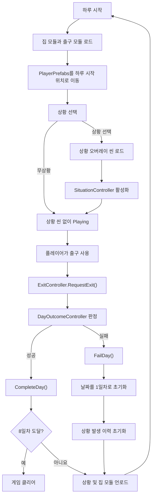
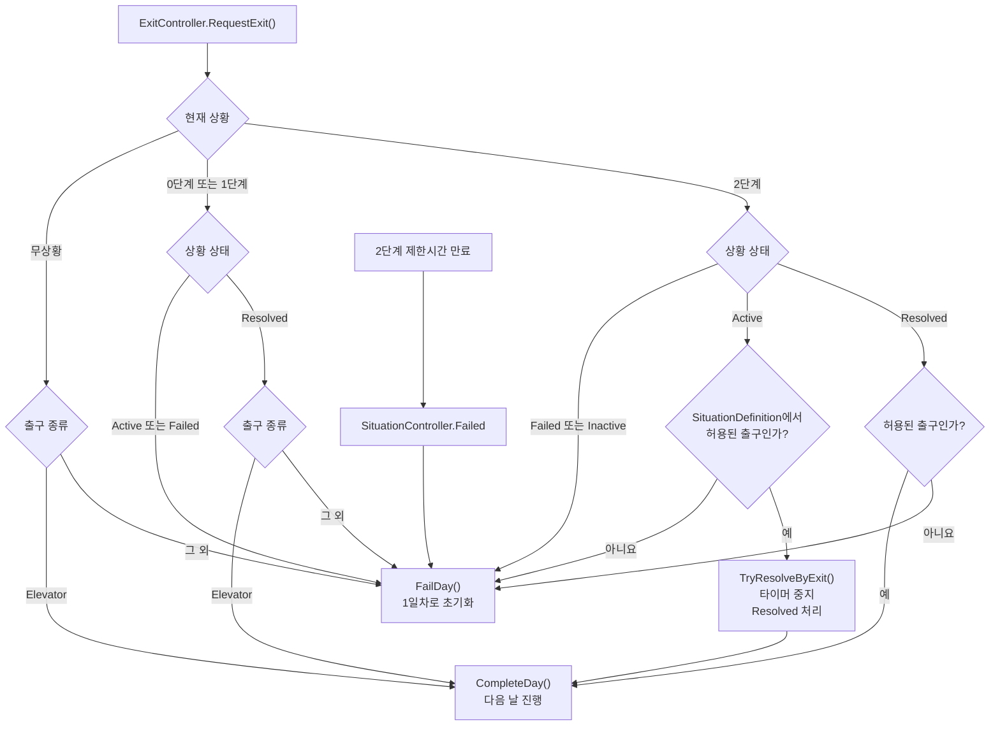

# 7 Days Unchecked 게임 루프 개발 계획

## 1. 목표

1일차부터 7일차까지 매일 집 모듈과 출구 모듈을 비동기로 구성하고, 무상황 또는 상황 하나를 진행한다. 7일차를 성공적으로 마쳐 8일차에 도달하면 한 사이클을 클리어한다.

상황이 선택되면 트리거, 오브젝트, 파티클, 오디오와 판정 로직만 포함한 상황 오버레이 씬을 Additive 방식으로 추가 로드한다. 상황 해결만으로 하루가 끝나지는 않으며, 플레이어가 상황 규칙에 맞는 출구를 사용해야 다음 날로 진행한다.

```text
하루 시작
→ 기본 집 모듈 및 임시 ExitScene 비동기 로드
→ PlayerPrefabs를 하루 시작 위치로 이동
→ 무상황 또는 상황 하나 선택
→ 선택된 경우 상황 오버레이 씬 로드 및 활성화
→ 플레이어 탐색 및 상황 해결
→ 출구 사용
→ DayOutcomeController가 상황 상태와 출구 종류 판정
→ 성공 시 다음 날 / 실패 시 1일차
→ 8일차 도달 시 클리어
```

## 2. 핵심 규칙

### 날짜와 사이클

- 1일차부터 7일차까지를 한 사이클로 취급한다.
- 다음 날로 진행할 때 현재 사이클의 상황 발생 이력을 유지한다.
- 실패하면 1일차로 돌아가며 상황 발생 이력을 전부 초기화한다.
- 7일차 성공 후 8일차에 도달하면 게임을 클리어한다.

### 상황 선택

- 하루에는 무상황이거나 정확히 하나의 상황만 존재한다.
- 같은 사이클에서 정상적으로 로드되어 제시된 0·1·2단계 상황은 다시 선택하지 않는다.
- 상황 ID는 상황 씬 로드와 초기화가 성공한 뒤 발생 이력에 등록한다.
- 무상황은 `SituationDefinition` 없이 `null`로 표현한다.
- 무상황은 발생 이력에 기록하지 않으며 한 사이클에서 반복될 수 있다.
- 현재 날짜에 등장 가능한 미발생 상황이 없으면 무상황으로 진행한다.

### 단계별 제한시간과 출구

| 진행 상태 | 제한시간 | 성공 가능한 출구 |
| --- | --- | --- |
| 무상황 | 없음 | 엘리베이터 |
| 0단계 | 없음 | 상황 해결 후 엘리베이터 |
| 1단계 | 없음 | 상황 해결 후 엘리베이터 |
| 2단계 | 양수 제한시간 사용 | 제한시간 내 해당 상황에 설정된 탈출구 도달 |

- 2단계에서는 엘리베이터를 허용하지 않는다.
- 0·1단계 상황은 미해결 상태에서 출구를 사용하면 실패한다.
- 2단계 상황은 `Active` 상태에서 허용된 출구에 도달하면 그 출구 요청으로 상황을 해결한다.
- `ResolveSituation()`은 출구 사용이 가능한 상태로 만드는 처리이며 날짜를 직접 변경하지 않는다.
- 2단계의 출구 해결도 내부적으로 `ResolveSituation()`을 거쳐 타이머를 중지한 뒤 날짜를 변경한다.
- 최종 날짜 변경은 `DayOutcomeController`만 `CompleteDay()` 또는 `FailDay()`를 호출해 수행한다.

## 3. 씬 구성

### Core 씬: `LoopBase`

Core 씬의 경로는 `Assets/01_Scenes/Situation/LoopBase.unity`다. 날짜가 바뀌어도 유지되는 전역 오브젝트만 가진다.

- XR Player와 Main Camera
- 전역 조명, UI, EventSystem 등 공통 요소
- `DayFlowController`
- `DaySceneCoordinator`
- `DayOutcomeController`
- `HomeModuleLoader`
- `SituationSelector`
- `SituationSceneLoader`
- `RadioController`

인스펙터 설정:

- `DayFlowController.Start Automatically`를 활성화한다.
- `DaySceneCoordinator`에 위 컨트롤러, 로더, 정의 에셋 참조를 연결한다.
- `DaySceneCoordinator.Player Root`에 Core 씬의 `PlayerPrefabs`를 연결한다.
- `DaySceneCoordinator.Day Start Spawn Point`에 매일 돌아갈 시작 위치를 연결한다.
- `DaySceneCoordinator.Screen Fader`에 `PlayerPrefabs` 자식 `XRFadeCanvas`의 `ScreenFader`를 연결한다.
- `DaySceneCoordinator.Radio Controller`에 하루 시작 방송을 담당할 `RadioController`를 연결한다.
- `DayOutcomeController`에 `DayFlowController`와 `SituationSceneLoader`를 연결한다.
- `RadioController.Radio Audio Source`에 라디오 방송을 재생할 AudioSource를 연결한다.
- 상황을 항상 발생시키는 테스트에서는 `SituationSelector.No Situation Chance`를 `0`으로 설정한다.

### 기본 집 모듈 씬

- 침실, 주방, 거실, 현관, 계단, 외부 환경 등 공통 맵 요소를 나눈다.
- `HomeLayoutDefinition`에 등록하여 매일 Additive 방식으로 함께 로드한다.
- XR Player, 게임 흐름 관리 컴포넌트, 전역 Camera를 포함하지 않는다.
- 모든 모듈은 동일한 월드 좌표계를 사용한다.

### 임시 출구 모듈 씬: `ExitScene`

`ExitScene`은 출구 흐름을 먼저 검증하기 위한 임시 모듈 씬이다. 최종 출구 오브젝트와 `ExitController`는 디자이너 작업이 끝난 뒤 `Hallway&Stair` 씬에 통합한다. 현재 `Hallway&Stair`는 디자이너가 작업 중이므로 개발자가 임의로 수정하지 않는다.

- 테스트 기간에는 `HomeLayoutDefinition`의 모듈 씬 목록에 `ExitScene`을 정확히 한 번 등록한다.
- `HomeModuleLoader`가 다른 집 모듈과 함께 매일 로드하고 언로드한다.
- 엘리베이터 모델 또는 상호작용 영역, Collider, XR 상호작용 컴포넌트와 `ExitController`를 둔다.
- 엘리베이터의 `ExitController.Type`은 `Elevator`로 설정한다.
- 비상계단, 경량칸막이, 완강기, 대피공간을 공통 출구로 구성한다면 같은 씬에 각각 알맞은 `ExitType`으로 배치할 수 있다.
- XR 이벤트나 기존 트리거가 `ExitController.RequestExit()`을 호출하도록 연결한다.
- 충돌만으로 `RequestExit()`이 자동 호출되지는 않는다.
- 다른 집 모듈 및 상황 오버레이와 동일한 월드 좌표를 사용한다.
- 디자이너가 `Hallway&Stair` 작업을 완료하기 전에는 해당 씬에 `ExitController`, Collider 또는 테스트용 오브젝트를 추가하지 않는다.
- 최종 통합 시 `ExitScene`의 출구 설정을 `Hallway&Stair`로 옮기고 `HomeLayoutDefinition`에서 `ExitScene`을 제거한다.
- 최종 통합 후에는 `ExitScene`과 `Hallway&Stair` 양쪽에 같은 출구가 동시에 존재하지 않도록 확인한다.

### 상황 오버레이 씬

- 씬 이름은 단계가 아니라 실제 상황을 기준으로 작성한다.
  - 예: `Scenario_Kitchen_MultiTapFire`, `Scenario_Vestibule_BlockedEntrance`
- 이벤트 트리거, 상황 오브젝트, 파티클, 오디오와 상황 판정 컴포넌트만 포함한다.
- 벽, 바닥, 공통 가구 등 기본 맵 요소를 포함하지 않는다.
- XR Player, Camera, Audio Listener, EventSystem, 전역 조명과 전역 Volume을 포함하지 않는다.
- 기본 집 모듈과 동일한 월드 좌표를 사용한다.
- 에디터에서 기본 집 모듈과 함께 Additive로 열어 배치하되 상황 씬 소속 오브젝트만 저장한다.
- 상황 오브젝트끼리는 Inspector 직접 참조를 사용한다.
- 각 상황 씬에는 `SituationSceneRoot`를 정확히 하나 둔다.
- 상황 씬은 엘리베이터나 기본 출구를 `Find()` 계열 API로 찾지 않는다.
- 상황 씬은 기본 출구의 이벤트를 직접 구독하지 않는다.
- 무상황일 때는 상황 오버레이 씬을 로드하지 않는다.

## 4. 출구 이벤트 및 결과 판정 구조

```text
임시 ExitScene 또는 최종 Hallway&Stair의 ExitController.RequestExit()
→ ExitController.ExitRequested 정적 이벤트 발행
→ Core 씬의 DayOutcomeController가 이벤트 수신
→ 현재 SituationSceneLoader 상태 확인
→ 상황 해결 여부와 SituationDefinition.IsExitAllowed() 검사
→ DayFlowController.CompleteDay() 또는 FailDay()
```

- `DayOutcomeController`가 활성화될 때 `ExitController.ExitRequested`를 한 번 구독하고 비활성화될 때 해제한다.
- `ExitController`는 출구 종류만 발행하며 성공·실패 또는 날짜를 판단하지 않는다.
- 상황 씬 로드 시 `ExitController`를 검색하거나 상황별 구독을 추가하지 않는다.
- 따라서 출구 판정 흐름에는 `Find()`, `FindObjectOfType()`, `FindAnyObjectByType()` 등의 전역 탐색이 필요하지 않다.
- 정적 이벤트는 플레이 세션 시작 시 초기화해 Domain Reload 비활성 환경에서 이전 구독이 남지 않도록 한다.

판정 규칙:

```text
무상황 + Elevator 요청
→ CompleteDay()

무상황 + 다른 출구 요청
→ FailDay()

0·1단계 미해결 + 모든 출구 요청
→ FailDay()

0·1단계 해결 + Elevator 요청
→ CompleteDay()

0·1단계 해결 + 다른 출구 요청
→ FailDay()

2단계 Active + 정의에 허용된 출구 요청
→ TryResolveByExit()
→ 타이머 중지 및 Resolved
→ CompleteDay()

2단계 Active 또는 Resolved + Elevator 또는 허용되지 않은 출구 요청
→ FailDay()
```

### 전체 게임 루프 다이어그램



### 단계·상태·출구별 판정 다이어그램



## 5. 스크립트 현황과 책임

### 1. `DayRunState` - 구현 완료

- 현재 날짜와 사이클 내 발생 상황 ID를 관리하는 순수 C# 객체다.
- `AdvanceDay()`는 발생 이력을 유지한다.
- `ResetRun()`은 날짜를 1일차로 되돌리고 이력을 초기화한다.
- `HasSeenSituation()`, `TryRegisterSituation()`, `SeenSituationIds`를 제공한다.

### 2. `DayFlowController` - 기본 구현 완료

- `DayRunState`를 소유한다.
- `Preparing`, `LoadingHome`, `Playing`, `Transitioning`, `Cleared` 상태를 관리한다.
- 하루 시작, 날짜 전환, 실패 초기화와 게임 클리어 이벤트를 발행한다.
- 로딩 중에만 `TryRegisterSituation()`으로 상황 ID 등록을 허용한다.
- `CurrentDay`, `CurrentState`, `SeenSituationIds`, `LastDayResult`를 외부에 제공한다.
- `CompleteDay(DayResultContext)`와 `FailDay(DayResultContext)`로 이전 하루의 결과 요약을 저장한다.

### 2-1. `DayResultContext` - 구현 완료

- 직전 하루 결과를 라디오, 결과 UI 등 후속 시스템에 전달하기 위한 작은 런타임 컨텍스트다.
- 현재는 `None`, `Completed`, `Failed` 결과와 `SituationId`, `SituationDefinition` 참조만 보관한다.
- 실패 원인, 선택한 출구, 제한시간 만료 여부 등이 필요해지면 이 컨텍스트에 필드를 추가해 확장한다.
- 후속 시스템은 `SituationSceneLoader`나 `DayOutcomeController` 내부 상태를 직접 조회하지 않고 이 컨텍스트를 사용한다.

### 3. `HomeLayoutDefinition` - 구현 완료

- 하루마다 함께 로드할 기본 집 모듈 씬 이름을 보관한다.
- 현재 테스트 단계에서는 임시 `ExitScene`도 이 목록에 포함한다.
- 최종 통합 후에는 `Hallway&Stair`가 출구를 포함하므로 `ExitScene`을 목록에서 제거한다.

### 4. `HomeModuleLoader` - 구현 완료

- 정의에 등록된 집 모듈과 현재 테스트용 `ExitScene`을 Additive 방식으로 비동기 로드한다.
- 자신이 로드한 씬만 추적하고 언로드한다.
- 빈 이름, 중복, Build Settings 누락과 이미 로드된 씬을 검증한다.

### 5. `ExitType` - 구현 완료

- `Elevator`, `EmergencyStairs`, `LightweightPartition`, `Descender`, `RefugeArea`를 정의한다.

### 6. `SituationDefinition` - 구현 완료

- 상황 ID, 단계, 가중치, 최소 등장 날짜와 상황 씬 이름을 보관한다.
- 0·1단계에서는 제한시간 설정을 무시하고 엘리베이터만 허용한다.
- 2단계에서만 양수 제한시간과 상황별 허용 출구 목록을 사용한다.
- `UsesTimeLimit`과 `IsExitAllowed()`가 단계별 규칙을 강제한다.
- 상황 ID는 사이클 내 중복 방지 기준이므로 비어 있거나 중복될 수 없다.

### 7. `SituationController` - 구현 완료

- 모든 상황별 컨트롤러의 공통 기반 클래스다.
- `Activate()`, `ResetSituation()`, `Resolved`, `Failed`를 제공한다.
- 2단계 상황의 제한시간 만료를 처리한다.
- `TryResolveByExit()`은 2단계 `Active` 상태와 허용 출구를 다시 검증하고 성공 시 타이머를 중지하며 해결 처리한다.
- 파생 상황은 조건 충족 시 `ResolveSituation()` 또는 `FailSituation()`까지만 호출한다.
- `CompleteDay()`와 `FailDay()`를 직접 호출하지 않는다.

### 8. `SituationSceneRoot` - 구현 완료

- 상황 씬의 명시적인 단일 진입점이다.
- 같은 상황 씬에 속한 `SituationController` 참조를 제공한다.

### 9. `SituationSceneLoader` - 구현 완료

- 선택된 상황 씬 하나를 Additive 방식으로 비동기 로드한다.
- 로드한 씬의 루트 오브젝트에서 `SituationSceneRoot`를 검사한다.
- 유효한 루트가 정확히 하나가 아니면 해당 상황 씬을 다시 언로드하고 실패 처리한다.
- 현재 `SituationDefinition`, `SituationSceneRoot`, `SituationController`를 추적한다.
- 출구 오브젝트를 전역 검색하지 않는다.

### 10. `SituationSelector` - 구현 완료

- 현재 날짜, 후보 목록과 발생 이력으로 상황 하나 또는 무상황을 선택한다.
- `MinimumDay`로 후보 진입 날짜를 제한하고 `Weight`로 가중 선택한다.
- 현재 사이클에서 이미 발생한 ID를 후보에서 제외한다.
- 유효 후보가 없으면 무상황을 반환한다.

### 11. `ExitController` - 구현 완료

- Inspector에서 설정한 `ExitType`을 `ExitRequested` 정적 이벤트로 발행한다.
- 공개 메서드 `RequestExit()`을 XR 상호작용 또는 트리거에 연결한다.
- 맵, 상황, 결과 판정 컴포넌트를 검색하거나 참조하지 않는다.
- 성공·실패를 판단하거나 날짜를 변경하지 않는다.

### 12. `DayOutcomeController` - 구현 완료

- Core 씬에서 출구 요청을 한 번 구독한다.
- `SituationSceneLoader`가 제공하는 현재 상황 정의와 컨트롤러를 사용한다.
- 무상황과 0·1단계의 해결 상태 및 출구 규칙을 판정한다.
- 2단계에서는 허용된 출구 도달을 `TryResolveByExit()`에 전달하고 해결 성공 후 하루를 완료한다.
- 성공 시 `CompleteDay(DayResultContext)`, 실패 시 `FailDay(DayResultContext)`를 호출한다.
- `SituationController.Failed` 이벤트도 현재 상황 ID를 포함한 실패 결과로 `FailDay(DayResultContext)`에 연결한다.

### 13. `DaySceneCoordinator` - 기본 구현 완료

- 하루 시작 시 `HomeLayoutDefinition`에 등록된 기본 집 모듈과 현재 테스트용 `ExitScene`을 먼저 로드한다.
- 집 로드 완료 후 Inspector로 연결된 `PersistentPlayerRoot`를 하루 시작 위치로 이동한다.
- 집 로드 완료 후 상황을 선택하고 필요한 경우 상황 씬을 로드한다.
- 상황 활성화 성공 후 상황 ID를 발생 이력에 등록한다.
- 하루 시작 로딩 중에는 `ScreenFader`로 검정 화면을 유지하고, 모든 준비가 끝난 뒤 페이드인한다.
- 무상황 또는 상황 준비 완료 후 `NotifyHomeLoaded()`로 플레이 상태에 진입한다.
- 페이드인 완료 및 Playing 진입 후 2초가 지나면 `RadioController`에 `LastDayResult`를 전달해 하루 시작 방송을 재생한다.
- 날짜 전환 시 상황 씬을 먼저 언로드하고 집 및 출구 모듈을 그다음 언로드한다.
- 언로드 완료 후 다음 날 로딩을 시작한다.
- 준비 실패 시 현재는 오류를 출력하고 `LoadingHome` 상태에 머문다. 실제 게임 적용 전 Error 상태 또는 준비 실패 API가 필요하다.

### 13-1. `RadioController` - 구현 완료

- Inspector로 연결된 `AudioSource`에서 하루 시작 방송 클립을 재생한다.
- 첫 시작, 무상황 성공, 상황 해결 후 다음 날 진행은 공통 방송 클립 목록에서 무작위로 하나를 선택한다.
- 실패 후 1일차로 돌아온 경우 `DayResultContext.SituationId`와 일치하는 실패 방송 엔트리의 클립을 재생한다.
- 실패 방송 엔트리와 매칭되지 않으면 선택적으로 설정한 fallback 실패 방송 클립을 사용한다.
- 실패 방송 매칭 기준은 씬 이름이나 배열 순서가 아니라 `SituationDefinition.Id`를 사용한다.

### 14. 테스트 상황 - 기본 프로토타입 구현 완료

- `Scenario_TestCube`에 `SituationSceneRoot`, `TempSituationController`와 비활성 Cube가 있다.
- 현재 임시 컨트롤러는 씬 로드 3초 후 Cube를 활성화하고 6초 후 자동 해결한다.
- 최종 테스트 컨트롤러는 `Start()` 대신 `OnActivated()`에서 상태를 초기화한다.
- 실제 발견 및 예방조치 입력을 공개 메서드로 받고 모든 조건 충족 시 `ResolveSituation()`을 호출한다.
- 상황 씬의 Main Camera와 Directional Light는 제거한다.

### 15. 씬 통합 - 진행 필요

- 임시 `ExitScene`에 출구 오브젝트 및 상호작용을 배치한다.
- 테스트 기간에는 `HomeLayoutDefinition`에 `ExitScene`을 등록한다.
- `LoopBase`에 `DayOutcomeController`를 배치하고 참조를 연결한다.
- 상황 해결 전·후 및 무상황에서 출구 판정 흐름을 통합 검증한다.
- 디자이너의 `Hallway&Stair` 작업 완료 후 협의하여 출구 오브젝트, 상호작용과 `ExitController`를 해당 씬에 통합한다.
- 통합이 끝나면 `HomeLayoutDefinition`에서 임시 `ExitScene`을 제거하고 중복 출구가 없는지 다시 검증한다.

## 6. 에디터 디버그 도구

### `ExitControllerEditor` - 구현 완료

- `ExitController` 기본 Inspector 아래에 `Request Exit` 버튼을 표시한다.
- 버튼은 플레이 모드에서만 활성화된다.
- 버튼을 누르면 선택한 컴포넌트의 `RequestExit()`을 호출한다.
- XR 상호작용 연결 전에도 출구 결과 판정을 빠르게 테스트할 수 있다.
- `Editor` 폴더에 있으므로 런타임 빌드에는 포함되지 않는다.

### `DayFlowControllerEditor` - 구현 완료

- `DayFlowController` Inspector에 현재 일자인 `Current Day`를 읽기 전용으로 표시한다.
- 플레이 중 날짜가 변경되면 Inspector 표시를 자동 갱신한다.
- 런타임 상태를 별도 직렬화 필드에 중복 저장하지 않는다.

## 7. 선택적 확장

`ModuleObjectRegistry`는 현재 범위에서 제외한다. 정적 출구 이벤트 전달에는 레지스트리나 `Find()`가 필요하지 않다.

상황에 따라 기본 맵 오브젝트를 직접 활성화·비활성화하거나 상태를 변경해야 할 때만 레지스트리를 추가한다.

적용 예:

- 엘리베이터 외형 또는 상호작용 비활성화
- 현관문 잠금
- 기본 멀티탭 숨김
- 창문 또는 비상구 상태 변경

이 경우 ID는 상황 생성 위치가 아니라 기본 맵의 변경 대상을 식별하는 용도로만 사용한다. 각 모듈 오브젝트가 로드될 때 등록하고 언로드될 때 해제하는 방식으로 구성하며 전역 탐색은 사용하지 않는다.

## 8. 주요 인터페이스

- `DayRunState`: 현재 날짜, 사이클 내 발생 이력, 초기화와 클리어 판정
- `DayFlowController`: 하루 생명주기, 상태 전이, 상황 이력 등록과 직전 하루 결과 보관
- `DayResultContext`: 직전 하루 결과와 관련 상황 ID 전달
- `HomeLayoutDefinition`: 기본 집 및 출구 모듈 씬 목록
- `HomeModuleLoader`: 기본 집 및 출구 모듈 로드·언로드
- `SituationSelector`: 무상황 또는 상황 하나 선택
- `SituationSceneLoader`: 상황 오버레이 하나 로드·활성화·언로드
- `SituationSceneRoot`: 로드된 상황 씬의 진입점
- `SituationController`: 상황 해결·실패 상태와 이벤트
- `ExitController`: 플레이어가 선택한 출구 종류 발행
- `DayOutcomeController`: 상황 상태와 출구 종류를 검증해 하루 결과 결정
- `DaySceneCoordinator`: 하루 시작과 전환 시 씬 로딩 순서 조율
- `RadioController`: 직전 하루 결과에 따라 하루 시작 라디오 방송 재생

시스템 간 통신은 매 프레임 상태를 검색하지 않고 명시적 참조와 이벤트로 처리한다.

## 9. 통합 검증 목록

1. `LoopBase` 시작 직후 기본 집 모듈과 현재 테스트용 `ExitScene` 로딩이 시작된다.
2. 모든 기본 모듈 로드가 끝난 뒤에만 상황을 선택한다.
3. 무상황이면 상황 씬 없이 `Playing` 상태로 진입한다.
4. 상황이 선택되면 해당 상황 오버레이 하나만 추가 로드한다.
5. 상황 활성화 성공 후에만 ID를 현재 사이클 이력에 등록한다.
6. 등록된 상황은 같은 사이클의 이후 날짜에 다시 선택되지 않는다.
7. 무상황은 이력에 남지 않으며 반복될 수 있다.
8. 실패 후 날짜와 상황 이력이 초기화되고 1일차로 돌아간다.
9. 무상황에서 `Elevator` 출구 요청 시 다음 날로 진행한다.
10. 무상황에서 다른 출구 요청 시 실패한다.
11. 0·1단계에서 제한시간이 시작되지 않는다.
12. 0·1단계 미해결 상태에서 출구를 사용하면 실패한다.
13. 0·1단계 해결 후 엘리베이터를 사용하면 다음 날로 진행한다.
14. 0·1단계 해결 후 다른 출구를 사용하면 실패한다.
15. 2단계에서 설정된 제한시간이 시작되고 만료 시 실패한다.
16. 2단계 `Active` 상태에서 제한시간 내 허용된 탈출구를 사용하면 타이머가 중지되고 `Resolved` 처리된 뒤 다음 날로 진행한다.
17. 2단계에서 엘리베이터 또는 허용되지 않은 출구를 사용하면 실패한다.
18. `ResolveSituation()`만으로 날짜가 증가하거나 씬이 언로드되지 않는다.
19. 출구 판정 과정에서 상황 씬이 `ExitController`를 검색하거나 구독하지 않는다.
20. 날짜 전환 시 상황 씬을 먼저 언로드하고 기본 집 및 현재 테스트용 `ExitScene`을 그다음 언로드한다.
21. 날짜가 반복되어도 씬, 이벤트 구독과 상황 오브젝트가 중복되지 않는다.
22. 7일차 성공 후 8일차에 도달하면 추가 날짜 로딩 없이 클리어된다.
23. `ExitControllerEditor` 버튼으로 XR 입력 없이 동일한 결과 판정을 테스트할 수 있다.
24. `DayFlowController` Inspector에서 플레이 중 현재 일자를 확인할 수 있다.
25. 디자이너 작업 완료 전까지 `Hallway&Stair` 씬에 개발용 변경이 발생하지 않는다.
26. 최종 통합 후 `ExitScene`은 모듈 목록에서 제거되고 출구는 `Hallway&Stair`에 한 번만 존재한다.
27. 첫날과 다음 날 모두 집 모듈 로드 후 상황 선택 전에 `PlayerPrefabs`가 지정한 하루 시작 위치로 이동한다.
28. 첫 시작, 무상황 성공, 상황 해결 성공 후 다음 날에는 공통 라디오 방송 중 하나가 재생된다.
29. 실패 후 1일차로 돌아오면 직전 실패 상황 ID에 매칭된 실패 라디오 방송이 재생된다.
30. 라디오 방송은 페이드인 완료와 `Playing` 상태 진입 후 2초 뒤에 재생된다.

## 10. 기본 결정

- 게임 루프 스크립트는 `Assets/02_Scripts/00_Loop` 아래에 작성한다.
- `DayRunState`는 순수 C# 객체로 유지한다.
- XR Player와 전역 게임 흐름 오브젝트는 Core 씬에 유지한다.
- 테스트 단계에서는 기본 집과 임시 `ExitScene`을 `HomeLayoutDefinition`을 통해 매일 Additive로 함께 로드한다.
- 상황은 기본 모듈 로딩이 모두 끝난 뒤 선택한다.
- 상황은 맵 지형이 없는 오버레이 씬 하나로 로드한다.
- 무상황 전용 오버레이 씬은 만들지 않는다.
- 출구는 상황 씬에 두지 않는다. 현재는 임시 `ExitScene`에 두고, 최종적으로는 `Hallway&Stair` 씬에 통합한다.
- 디자이너가 작업 중인 `Hallway&Stair`는 작업 완료 및 협의 전까지 수정하지 않는다.
- 상황 씬은 기본 출구를 검색하거나 직접 구독하지 않는다.
- 출구 요청은 `ExitController`의 정적 이벤트로 전달하고 `DayOutcomeController`가 한 곳에서 판정한다.
- 상황 해결과 날짜 진행을 분리한다.
- 씬 로딩과 언로딩은 `DaySceneCoordinator`만 담당한다.
- 이전 하루 결과는 `DayResultContext`로 보관하고, 후속 연출 시스템은 이 컨텍스트를 통해 결과를 해석한다.
- 라디오 실패 방송은 `SituationDefinition.Id` 기준으로 매칭하며 배열 순서에 의존하지 않는다.
- 초기 버전에서는 저장·불러오기, 전체 방 교체 씬과 범용 오브젝트 레지스트리를 구현하지 않는다.
